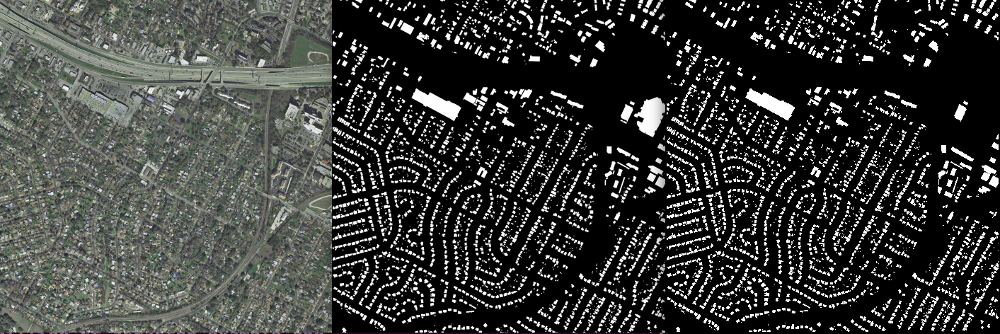
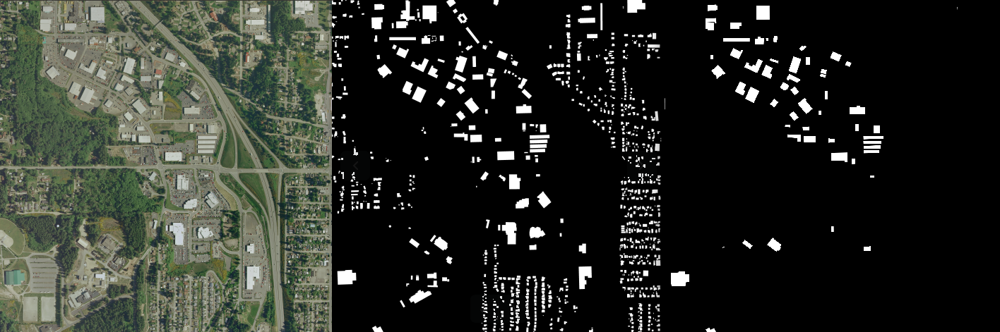

# OSM deep labels

## Motivation

This repository aims at producing deep learning labels starting from
OpenStreetMap (OSM) data for semantic segmentation algorithms applied to aerial
images.

The project is strongly related
to [Deeposlandia](http://github.com/Oslandia/deeposlandia), another Oslandia
project dedicated to deep learning algorithm design.

## Installation

This project runs under Python 3.

### Basic dependencies

Within a virtual environment , by downloading the repo and `pip`-ing the
`setup.py` file:

```
git clone http://github.com/Oslandia/osm-deep-labels
cd osm-deep-labels
pip install .
```

### Extra dependencies

#### GDAL

The project requires `GDAL`. For ̀Ubuntu` distributions, the following
operations are needed to install this program:

```
sudo apt-get install
libgdal-dev sudo apt-get install python3-gdal
```

The `GDAL` version can be verified by:

```
gdal-config --version
```

Now let's retrieve a `GDAL` for Python that corresponds to the `GDAL` of system:
```
pip install --global-option=build_ext --global-option="-I/usr/include/gdal" GDAL==`gdal-config --version`
python3 -c "import osgeo; print(osgeo.__version__)"
```

For other OS, please visit the `GDAL` installation documentation.

#### Mapnik

Additionnally `Mapnik` is required for rendering purpose. As for `GDAL`, the
installation process has been tested only with a `Ubuntu` distribution.

First, install `Mapnik` through `apt-get`:

```
sudo apt-get install libmapnik-dev
```

Then you can verify the version of the software with the following command:

```
mapnik-config -v
```

Then you must get the `Mapnik` Python bindings. One possible solution is to
clone the corresponding Github repository:

```
git clone https://github.com/mapnik/python-mapnik
cd python-mapnik
git checkout v3.0.16
pip setup.py install
```

And voilà!

## Results

By focusing
on [INRIA Aerial Image dataset](https://project.inria.fr/aerialimagelabeling/),
we can visually compare the output of this project with aerial image labelled
versions.

For instance, one can show an extract of Austin, Texas, where OSM data quality
seems good:



Another example show on the opposite a case of OSM failure, in Kitsap County,
Washington:


